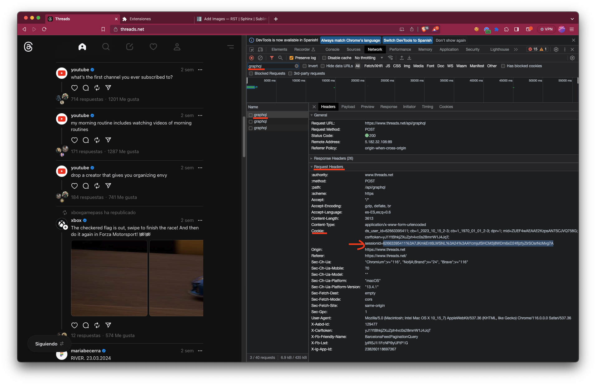
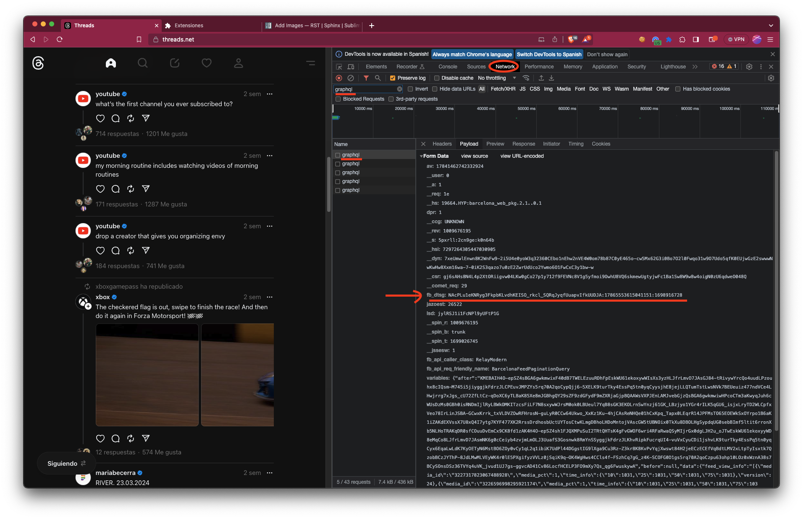
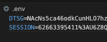

Usage
=====

Installation
------------

To use Threads Scraper, first install it using pip:

.. code-block:: console

  $ pip install threadscraper

Session verification
--------------------

In order to extract many of the data from Threads, you need to be logged in  an account.
To authenticate the session within our library, you need to import certain cookie values to use them

The easiest way to do so is to download the threads request listener extenion for chrome, 
login to the account using a VPN or proxy in your chrome browser and copy the cookie values
from the extension.

Alternatively, you can inspect the network requests in the developer tools of your browser
if you want to extract this values manually. To do so open the browser developer tools 
(ctrl+shift+i / cmd+alt+i) and go to the network tab. Then scroll or navigate in the website
until you see certain requests called graphql. Click on one of them and go to the headers tab.
Pay attention to the Cookies in the sending request in the headers tab. Copy the values of the
session id and in the payload tab copy the value of the fb_dtsg parameter.

These 2 variables should be stored in the .env file with using the keys
DTSG and SESSION. Alternatively, they can be loaded as variables and passed
as parameters to the functions. (recommended in case you want to manage 
multiple sessions)

Your dotenv (.env) file should look like this:

Retrieving information about users
----------------------------------

To get all information about users import the functions in users

.. code-block:: python

  import threadscrapers.users

  